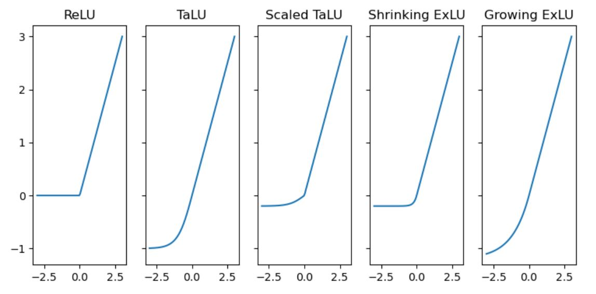
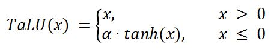
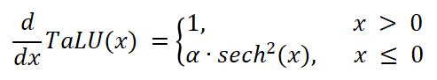
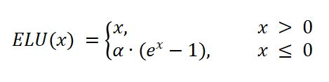
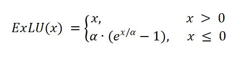

# Building your Own Activation: TaLU & Smooth ELU
## Combining tanh and ReLU into "TaLU" and modifying ELU to have a continuous derivative
#### Dr John Hughes

<br>
This work explores rolling your own Activation Functions as a means to improve Machine Learning results. To demonstrate the methodology two activations are built. The first, **TaLU**, is built by combining the well-known activation functions **tanh** and **ReLU**. The second, **ExLU** is a modification of the **ELU** Activation Function.

#### Hand-rolled Activation Functions



## Quickstart
```bash
git clone https://github.com/DrJohnHughes/Activation-Functions.git
cd Activation-Functions

# --- Option A: GPU (NVIDIA) ---
conda env create -f environment-gpu.yml
conda activate activation-functions

# --- Option B: CPU-only (safer everywhere) ---
# conda env create -f environment-cpu.yml
# conda activate activation-functions

# Run notebooks
jupyter lab
```

##### Verify GPU support in the notebook
```python
import torch
print("torch", torch.__version__, "| cuda:", torch.cuda.is_available())
```

#### Pip Alternative
```
# pip alternative (CPU):
python -m venv .venv && . .venv/Scripts/activate  # or 'source .venv/bin/activate' on mac/linux
pip install -r requirements.txt

# pip alternative (GPU, NVIDIA):
# Install torch/vision/torchaudio via the official index URL first, e.g. for CUDA 12.1:
#   pip install --index-url https://download.pytorch.org/whl/cu121 torch torchvision torchaudio
# Then install the rest:
#   pip install -r requirements.txt --no-deps
```

### Definitions

**TaLU (α·tanh for x<0; identity for x≥0)**

$$
\text{TaLU}_{\alpha}(x)=
\begin{cases}
\alpha\,\tanh(x), & x<0\\
x, & x\ge 0
\end{cases}
$$

**ExLU (smooth ELU)**

$$
\text{ExLU}_{\alpha}(x)=
\begin{cases}
\alpha\big(e^{x/\alpha}-1\big), & x<0\\
x, & x\ge 0
\end{cases}
$$

### TaLU

**ReLU** is designed for situations where you want to remove a zero derivative when training a neural network. This is a very successful way to train Neural Networks but has the downside that it can effectively exclude large sections of a neural network (sometimes referred to as "dying ReLU") making it potentially less productive than it could be given its size. “dying ReLU” occurs when many units get stuck at `x<0`.  TaLU’s tanh side can mitigate zero-gradient risk there.

Activation Functions that favor a positive value without zeroing out the negative will allow more of the network to be in play during learning which may support greater accuracy. **Leaky ReLU** is one Activation Function that attempts to improve ReLU by allowing negative values to exist rather than being zeroed out.

**Tanh** is a popular Activation Function that supports negative values that are smoothly mapped to `(−1,0)` so it makes for a compelling candidate to combine with ReLU. One great plus for this combination is that they naturally blend together as their derivatives are 1 around 0. The derivative of tanh(x) is very cheap to compute:

```md
Let `a = tanh(x)`. Then `tanh’(x) = 1 − a²`.
```

Thus we aim to outperform ReLU by combining **ReLU** and **tanh** into an efficient Piecewise Activation Function I will refer to as **TaLU** (**Tanh-ified Linear Unit**). TaLU takes the values of ReLU for inputs above 0 and for all other inputs it takes the values of tanh scaled by **α**:

**TaLU**  

<br>

**Derivative of TaLU**  

<br>

This combination is fast and preserves sparsity on the positive side (ReLU); bounded negatives on the other. The function is continuous, non-linear, has non-zero gradients everywhere and can be differentiated. Scaling TaLU may further improve results. The only caveat is that tanh saturates for large negative values, which could slow learning, but this could be controlled or regularized.

TaLU shows some promising results. It has limited but growing literature. The Activation Function is potentially a useful way to handle vanishing gradients that may present with ReLU and it offers a smooth gradient change around 0. The bounded negative side (tanh) can dampen extreme negatives; while the linear positive side (ReLU) keeps gradients flowing. Besides **TaLU**, the combination of tanh and ReLU is also recorded in the literature as **tanhLU**. See the following papers for more details:

+ _Shui-Long Shen et al. (2022). Enhancement of neural networks with an alternative activation function tanhLU._
  [https://doi.org/10.1016/j.eswa.2022.117181](https://doi.org/10.1016/j.eswa.2022.117181)

+ _Md. Mehedi Hasan et al. (2023). TaLU: A Hybrid Activation Function Combining Tanh and Rectified Linear Unit to Enhance Neural Networks._
  [https://arxiv.org/abs/2305.04402](https://arxiv.org/abs/2305.04402)

+ _Ashish Rajanand and Pradeep Singh (2023). ErfReLU: Adaptive Activation Function for Deep Neural Network._
  [https://arxiv.org/abs/2306.01822](https://arxiv.org/abs/2306.01822)

Similarly to the approach taken by _Md. Mehedi Hasan et al. (2023)_ this notebook tests Activation Functions on the easily available MNIST and CIFAR-10 datasets.

### ExLU

This Notebook also proposes a modification of the **ELU** Activation Function which I will refer to as **ExLU**. ExLU as a variation of ELU that preserves the derivative at 0 to be continuous for any `α` whereas ELU is discontinuous unless `α = 1`.

In ExLU, dividing by `α` inside the exponential and multiplying by `α` outside makes the derivative continuous at 0 for any `α>0`; the shape is smooth, monotonic, and has no “kink”.

Compare ELU and ExLU:

**ELU**  

<br>

**ExLU**  

<br>

<details>

### Initialization (optional)
Most small demos work fine with defaults. If you hit vanishing/exploding gradients, try these:

ReLU (He/Kaiming, fan_in): std ≈ sqrt(2/fan_in)

```python
import torch.nn as nn
nn.init.kaiming_normal_(layer.weight, nonlinearity='relu')
```

tanh (Xavier/Glorot): std ≈ sqrt(1/fan_in)

```python
import torch.nn as nn
fan_in, _ = nn.init._calculate_fan_in_and_fan_out(layer.weight)
std = (1.0 / fan_in) ** 0.5
nn.init.normal_(layer.weight, mean=0.0, std=std)
```

TaLU (tanh for x<0, ReLU for x≥0): start with He; if negatives saturate, nudge variance toward Xavier:
```python
fan_in, _ = nn.init._calculate_fan_in_and_fan_out(layer.weight)
std = (1.5 / fan_in) ** 0.5   # between Xavier and He
nn.init.normal_(layer.weight, mean=0.0, std=std)
# or a LeakyReLU-style He init:
nn.init.kaiming_normal_(layer.weight, a=0.1, mode='fan_in', nonlinearity='leaky_relu')
```
</details>
